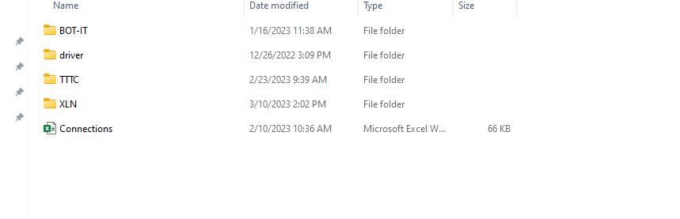

## Project name: MCI TEST
## Set up 
1.Set up wsl2 in windown 10
    
2.Install Pycharm
3.Install Python3
4.Install Pip3
5.Install Env python
6.Create 6 file:
    - dwh.cfg: Info redshift and S3 role
    - sql_queries: SQL in redshift
    - test.ipynb: Test data from S3
    - create_table: Create table in redshift
    - etl: 
        + Load data from s3->Redshift(STG)
        + Redshift(STG)-> Redshift(DWH)
## License
Author: ManhLV

