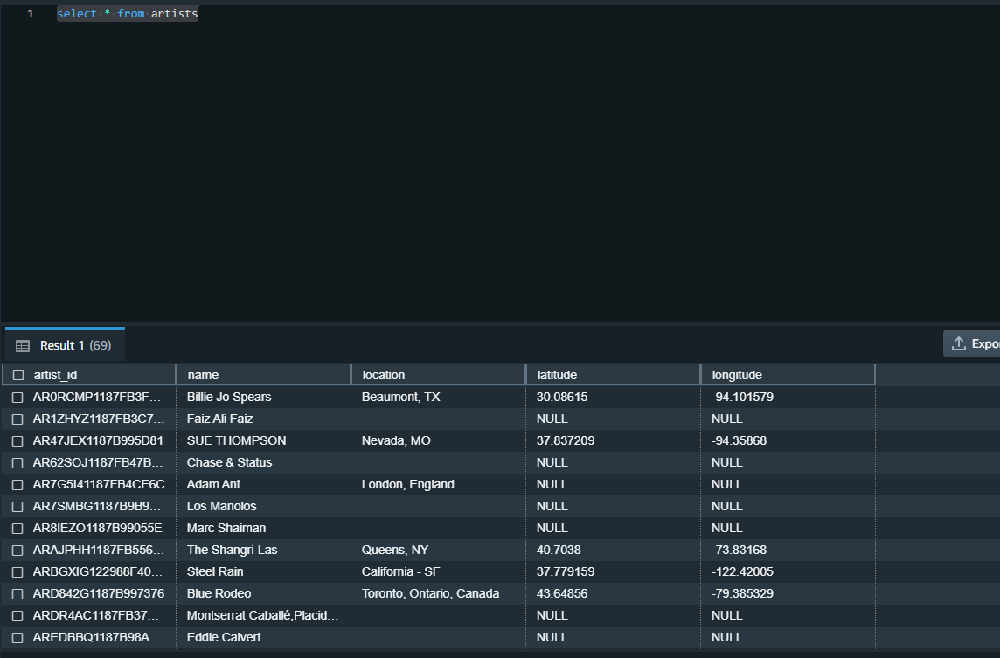

## Project name: MCI TEST
## Set up 
```
$ Set up wsl2 in windown 10
```

```
$ Install Pycharm
```

```
$ Install Python3
    1. sudo apt update
    2. python3 -V 
```

```
$ Install Pip3
    1.sudo apt install python3-pip
    2.pip3 --version
```

```
$ Install Env python
    1.sudo apt update
    2.pip3 install virtualenv
    3.virtualenv mci_env
    4.pip3 install -r requirements.txt
    5.source /home/user/mci_env/bin/activate
```

## Design 
```
$ Upload data from ggsheet ->S3
```

```
$ Design 3 procedures : 
    1. public.proc_create_table():
        - Drop table if table is exist
        - Create tables
    2. public.proc_s3_to_tb(name_tb,path):
        - Load data from S3 to Redshift(STG)
    3. public.proc_music_sample():
        - clean and standardize table
        - Load data to Redshift(DWH)
```

```
$ Create 6 file in Project(mci_test):
    - dwh.cfg: Info redshift and S3 role 
    - requirements: library env python3
    - sql_queries: SQL in redshift 
        - Contain 3 procedures:
            + public.proc_create_table()
            + public.proc_s3_to_tb(name_tb,path)
            + public.proc_music_sample()
    - test.ipynb: Test data from S3
    - create_table: Create table in redshift
        - call public.proc_create_table()
    - etl:
        + Load data from s3->Redshift(STG)
          - call public.proc_s3_to_tb(name_tb,path)
        + Redshift(STG)-> Redshift(DWH)
          - call public.proc_music_sample()
```
## Run project
```
$ jupyter notebook(test data from S3):
```

```
$ run create_tb.py(init table in redshift):
```

```
$ run etl.py(load data):
```

## Diagram:

## Results
```
$ Table log_data:
```

```
$ Table song_data:
```

```
$ Table artists:
```

```
$ Table users:
```

```
$ Table time:
```

```
$ Table songs:
```

```
$ Table songplays:
```

## License
Author: ManhLV

